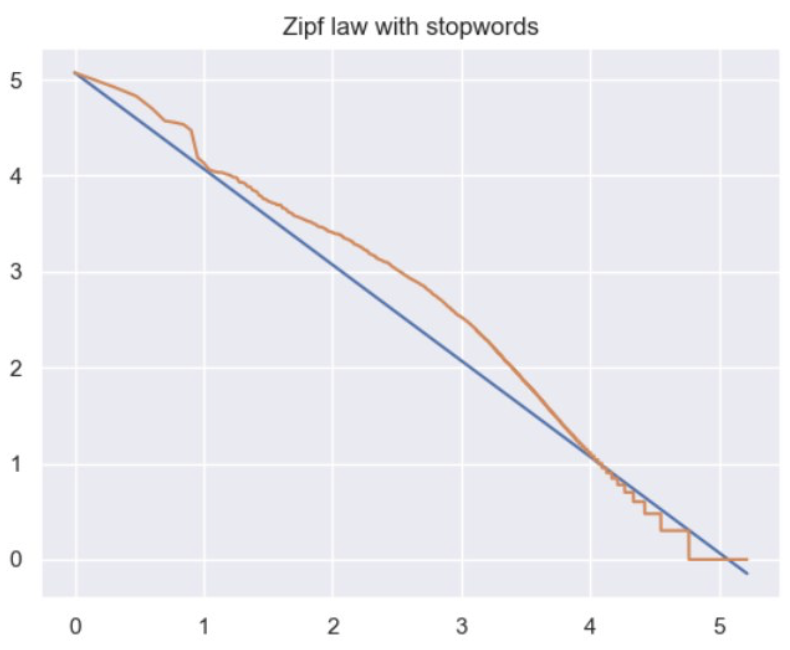
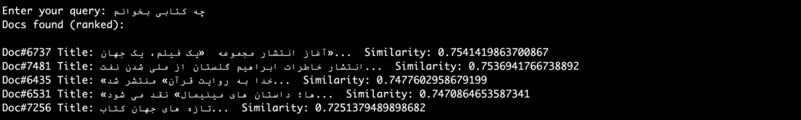

# Search Engine

This project is an information retrieval search engine developed for an Information Retrieval course. Its workflow
consists of preprocessing the data and then answering the queries using various approaches including positional
indexing, TF-IDF vectorizing, and Word2Vec embedding. The search speed is boosted using techniques such as index
elimination, champions list, and clustering. The engine classifies documents with KNN into multiple categories based on
their topic.

The engine is tested on the Iranian Student News Agency (ISNA) archived news dataset. Detailed project descriptions and reports
can be found in the `docs/instructions.pdf` and `docs/report.pdf` files, which are in Persian.

## Project Description

### Phase 1: Preprocessing and Indexing

The first phase includes preprocessing steps such as normalization, tokenization, stemming, and stopwords removal. A
positional indexing of the words is then created and cached. Boolean search is implemented in this phase.

### Phase 2: Search in Vector Space

In the second phase, vector representations of the documents are created. The most similar document vectors to the
vector of the input query are found using the following two strategies:

- **Statistical Approach (TF-IDF):** Each document is represented by a vector containing the weights for all of its
  words. The weight of each word is measured by the tf-idf measure. Words not present in the document are weighed 0.
  The tf-idf measure is calculated as follows

$$\text{tfidf}(t, d, D) = \text{tf}(t, d) \times \text{idf}(t, D) = (1 + \log(f_{t,d})) \times \log(N/n_t)$$

  where $f_{t,d}$ is the number of occurrences of the term $t$ in the document $d$, and $n_t$ is the number of
  documents containing the term $t$.

- **Embedding Approach (Word2Vec):** Using the `gensim` library and the `word2vec` model, the vector representation of
  the documents is calculated. Each word in this vector is represented by a 300-dimensional vector. The document vector
  is calculated as a weighted average of all the words where the weights are the tf-idf measures of the words.

Two techniques are implemented for faster retrieval:

- **Index Elimination:** Documents with 0 vector are discarded, so that their similarity with the input query is not
  calculated.
- **Champions List:** In the preprocessing step, a list of most documents for each term is stored, which is called the
  champions list. This way, when a query comes, its vector is only compared with document vectors of the documents in
  the champions list of query words.

The similarity between vectors is calculated using the cosine similarity.

$$\text{cosine similarity}(A, B) = \frac{A \cdot B}{\lVert A \rVert \lVert B \rVert}$$

where A and B are the document and query vectors respectively.

### Phase 3: Clustering and Classification

- **Clustering:** Using K-Means, a query vector is compared with the document vectors of the top b most similar
  clusters, instead of all document vectors. The K-Means algorithm is run multiple times, and the best clustering is
  selected considering their residual sum squared errors (RSS).
- **Classification:** The search engine supports taking a category besides a query, and search for the query in only
  that category. The categories include "Sports", "Economics", "Politics", "Culture", and "Health". The KNN algorithm is
  used for classification, with a 10-fold cross-validation setup.

## Implementation

The project consists of the following files:

- `io_handlers.py`: This file reads the raw or the preprocessed datasets. It also caches the positional indexes and
  other preprocessed data.
- `preprocessing.py`: This file performs preprocessing.
- `engines`: A base class called `BaseQueryEngine` is defined which defines the interface for all retrieval methods, and
  has some common variables such as the preprocessed data and the indexes. Out of this base class, different engines,
  such as `IndexedQueryEngine` (phase 1), `VectorizedQueryEngine` and `WordEmbeddingQueryEngine` (phase 2)
  and `KMeansQueryEngine` and `KNNQueryEngine` (phase 3) are created.

## Evaluation

For each phase, the results of the algorithms for a few example queries are shown. For the vectorized methods, metrics
such as `precision@1`, `precision@5`, `Mean Average Precision`, and `reciprocal rank` are calculated and compared.

The implemented methods are also compared against **Zipf**'s and **Heap**'s laws.

- Zipf's law states that the frequency of any word is inversely proportional to its rank in the frequency table.
- Heap's law describes that as the number of words in a document increases, the rate of the count of distinct words
  available in the document slows down.

## Course Information

- **Course**: Information Retrieval
- **University**: Amirkabir University of Technology
- **Semester**: Fall 2021

Let me know if you have any questions.
